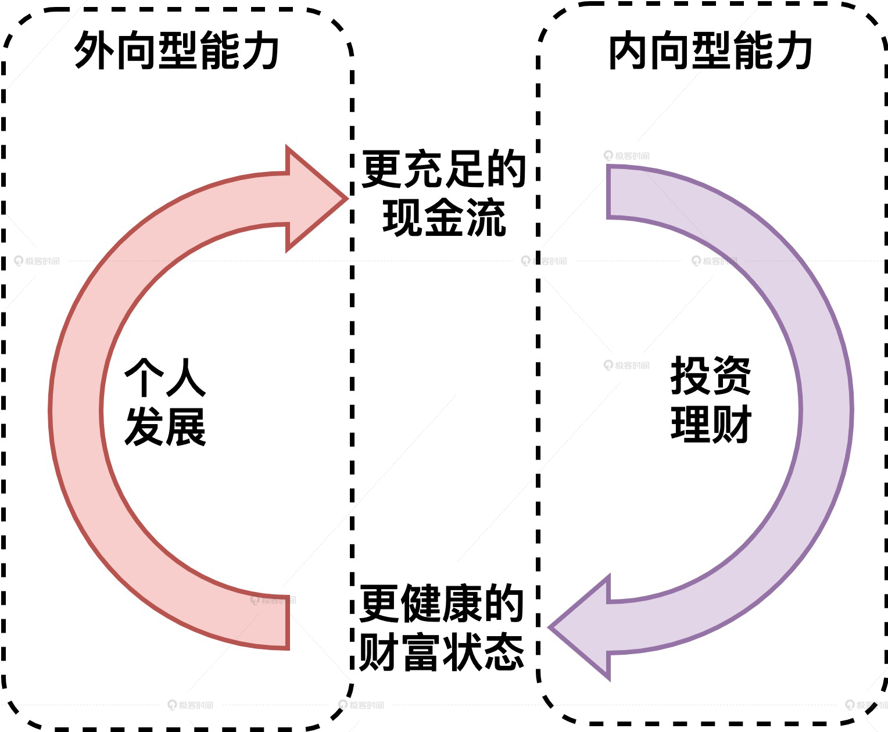

# 财富框架篇

## 01 | 财富框架：建立属于你自己的财富双塔

抽时间阅读《富爸爸，穷爸爸》。

时间既不是省出来的，也不是挤出来的，时间是你提前隔离出来的。

# 个人发展篇

## 07｜职业方向：如何选择一个有前景的职业方向？

1. 有前景的职业方向有两个特点，一是**高度高**，二是**容量大**。
2. 在具体找工作时，不仅要考虑长期发展，还要考虑短期**供需关系**的影响。
3. **选择后的坚持才是影响你收入的第一要素**，因此不建议在没有规划的情况下频繁跳槽。
4. 只要满足这两个典型条件之一，就建议你转换职业方向：第一个是个人转方向的决心非常坚定，对自己非常有信心；第二个是当前职业方向进入了长期下行通道。
5. 转换职业方向，具体可以分为三个步骤：第一步，**下决心**，开弓没有回头箭；第二步，**定目标**，提前一年查目标岗位的 JD，确立详细的目标；第三步，**攒经验**，千方百计地向你的目标岗位靠近。

## 08｜职业规划：大公司VS小公司，怎样选择更有前途？

